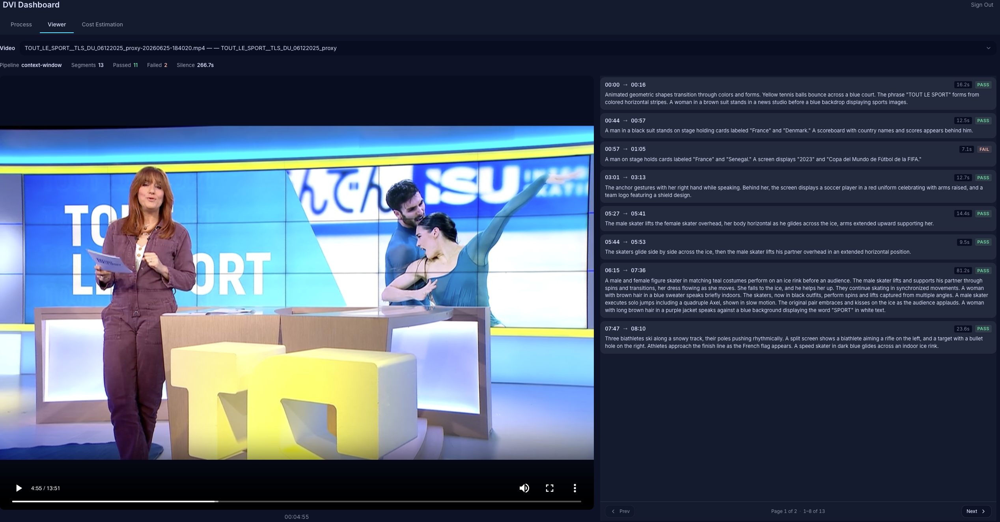

# Automated Audio Description Using Generative AI

A serverless pipeline that automatically generates **Descriptive Video Information (DVI)** — spoken narrations of visual content inserted during silence gaps in videos — to improve media accessibility for visually impaired audiences.

## Why DVI Matters

Audio description (also called Descriptive Video Information) is essential for making video content accessible to people who are blind or have low vision. The FCC mandates audio description for major broadcasters in the US, and WCAG 2.1 Success Criterion 1.2.5 recommends it for web content. This sample demonstrates how generative AI can automate the historically expensive and time-consuming process of creating audio descriptions.

## Overview

This sample deploys a complete end-to-end system that:

1. **Detects silence gaps** in video audio tracks using Amazon Transcribe
2. **Analyzes visual content** during those gaps using the Twelve Labs Pegasus video understanding model via Amazon Bedrock
3. **Generates narration text** from visual analyses using Claude on Amazon Bedrock
4. **Synthesizes speech** from narration text using Amazon Polly
5. **Mixes narration audio** back into the original video using FFmpeg

It includes a React dashboard for triggering the pipeline, viewing results, and estimating per-execution costs.

## Architecture

The system has two parts: a Step Functions processing pipeline that turns a raw video into a described-video output, and a web dashboard for operating it.

### Processing Pipeline


### System Architecture


### Application UI

This is the web application deployed — the Viewer page plays a processed video alongside its DVI narration segments.



### How It Works

1. **Validate** — Checks video file size (< 8 GB) and duration (< 8 hours) before processing
2. **Transcribe** — Amazon Transcribe extracts a full transcript with timestamps
3. **Silence Detection** — Identifies gaps ≥ 4 seconds with no speech: between speech segments, and also _before the first segment_ (intros) and _after the last segment_ (outros), so leading and trailing visuals get described too
4. **Extract Segments** — For each silence gap, extracts a video clip with configurable context padding (default: 5s before, 2s after the gap) so the AI model understands the visual narrative
5. **Analyze** — Twelve Labs Pegasus describes the visual content in each clip
6. **Generate DVI** — Claude generates concise, accessibility-focused narration text from each analysis
7. **Synthesize** — Amazon Polly converts narration text to speech, constrained to fit within the silence duration
8. **Mix** — FFmpeg positions each narration audio at the correct timestamp and mixes it into the original video

For a deeper, function-by-function explanation of the pipeline and the rationale behind each design choice, see the [backend Lambda guide](backend/LAMBDAS.md).

## Prerequisites

- **AWS Account** with permissions to create Lambda, Step Functions, S3, DynamoDB, API Gateway, CloudFront, and Bedrock resources
- **AWS CLI** configured with credentials
- **Node.js 18+** (for React frontend build and CDK)
- **Python 3.12+** (for CDK and Lambda functions)
- **curl** (for downloading the FFmpeg binary)
- **Amazon Bedrock model access** enabled for:
  - Twelve Labs Pegasus 1.2 (`us.twelvelabs.pegasus-1-2-v1:0`)
  - Anthropic Claude Sonnet (`us.anthropic.claude-sonnet-4-5-20250929-v1:0`)

### Enabling Bedrock Model Access

1. Open the [Amazon Bedrock console](https://console.aws.amazon.com/bedrock)
2. Navigate to **Model access** in the left sidebar
3. Request access to **Twelve Labs Pegasus 1.2** and **Anthropic Claude Sonnet**
4. Wait for access to be granted (may take a few minutes)

> Twelve Labs Pegasus is offered through AWS Marketplace. If this is the first time your account uses it, you may also need permission to subscribe to the model in Marketplace before invocation succeeds.

## Deployment

### Quick Start

```bash
git clone <repository-url>
cd sample-code-for-automated-video-audio-description-using-generative-ai

# Deploy everything with one command
./deploy.sh
```

The deploy script will:

1. Install Python CDK dependencies
2. Bootstrap CDK in your account/region
3. Build the React frontend
4. Deploy two CloudFormation stacks (Pipeline + Dashboard)

Deployment takes approximately 10-15 minutes.

### Manual Deployment

```bash
# Install dependencies
pip install -r requirements.txt

# Bootstrap CDK (first time only)
npx cdk bootstrap

# Build frontend
cd dashboard/frontend && npm ci && npm run build && cd ../..

# Deploy
npx cdk deploy --all
```

### Deploy to a Specific Region

```bash
npx cdk deploy --all --context region=us-west-2
```

## Usage

### 1. Sign In to the Dashboard

During deployment, an admin user is automatically created with the email you provided. Check your email for a temporary password from Amazon Cognito.

Open the Dashboard URL (printed in deployment outputs) and sign in with your email and temporary password. You'll be prompted to set a new password on first login.

### 2. Upload a Video

After deployment, upload an MP4 video to the S3 bucket:

```bash
# Get the bucket name from deployment outputs
BUCKET_NAME=$(aws cloudformation describe-stacks \
  --stack-name DviPipelineStack \
  --query 'Stacks[0].Outputs[?OutputKey==`BucketName`].OutputValue' \
  --output text)

# Upload your video
aws s3 cp your-video.mp4 s3://$BUCKET_NAME/input/your-video.mp4
```

### 3. Open the Dashboard

The dashboard URL is printed in the deployment outputs. It provides three pages:

- **Viewer** — Browse processed videos, watch them with DVI narration, view per-segment details
- **Trigger** — Select an input video and start processing
- **Cost** — View per-execution cost breakdowns across all AWS services used

### 4. Trigger the Pipeline

From the Trigger page in the dashboard:

1. Select an input video
2. Click "Trigger Pipeline"
3. Confirm the execution (a cost estimate is shown)
4. Monitor progress in real-time

## Project Structure

```
├── app.py                       # CDK app entry point
├── cdk.json                     # CDK configuration
├── deploy.sh                    # One-command deployment
├── destroy.sh                   # One-command teardown
├── requirements.txt             # Python CDK dependencies
│
├── docs/                        # Architecture diagrams (.drawio source + PNGs)
│
├── infrastructure/              # CDK stack definitions
│   ├── pipeline_stack.py        # Pipeline: S3, DynamoDB, Lambdas, Step Functions
│   └── dashboard_stack.py       # Dashboard: Cognito, API GW, CloudFront, S3 hosting
│
├── backend/                     # Pipeline Lambda functions
│   ├── LAMBDAS.md               # Function-by-function guide (config + rationale)
│   ├── lambdas/
│   │   ├── validate_input/      # Input validation (size, duration checks)
│   │   ├── transcribe_video/    # Speech-to-text transcription
│   │   ├── silence_detection/   # Detect gaps ≥4s in audio
│   │   ├── extract_silence_segments/ # Extract clips with context (FFmpeg)
│   │   ├── analyze_silence_segment/  # Visual analysis (Pegasus)
│   │   ├── generate_dvi/        # Narration text generation (Claude)
│   │   ├── synthesize_audio/    # Text-to-speech (Polly)
│   │   ├── mix_audio_tracks/    # Mix DVI into video (FFmpeg)
│   │   ├── write_summary_dynamodb/   # Store processing summary
│   │   └── write_summary_s3/    # Write human-readable summary
│   └── layers/
│       └── ffmpeg/              # FFmpeg Lambda layer (static binary via build-layer.sh, no Docker)
│
└── dashboard/                   # Web dashboard
    ├── lambdas/                 # Dashboard API Lambda functions
    └── frontend/                # React + TypeScript app (see FRONTEND.md)
```

## Documentation

- [`backend/LAMBDAS.md`](backend/LAMBDAS.md) — every backend Lambda explained: configuration, key code, and why each design choice was made (including the cost calculator).
- [`dashboard/frontend/FRONTEND.md`](dashboard/frontend/FRONTEND.md) — a short tour of the React dashboard: structure, the API/auth layers, and the Tailwind v4 + shadcn/ui setup.

## Cost Estimate

Costs depend on video length and number of silence segments. For a typical 5-minute video with 5-8 silence segments:

| Service             | Estimated Cost  |
| ------------------- | --------------- |
| Lambda              | ~$0.01          |
| Step Functions      | <$0.01          |
| Transcribe          | ~$0.12          |
| Bedrock (Pegasus)   | ~$0.05-0.15     |
| Bedrock (Claude)    | ~$0.01          |
| Polly               | <$0.01          |
| S3                  | <$0.01          |
| DynamoDB            | <$0.01          |
| **Total per video** | **~$0.15-0.30** |

The dashboard includes a built-in Cost page that calculates actual per-execution costs.

## Cleanup

To remove all deployed resources:

```bash
./destroy.sh
```

Or manually:

```bash
npx cdk destroy --all --force
```

## Limitations

- **Video file size**: Maximum 8 GB (Lambda ephemeral storage constraint). For larger files, re-encode at a lower bitrate or extend the FFmpeg steps to use ECS Fargate.
- **Video duration**: Maximum 8 hours (Amazon Transcribe limit). The pipeline validates both size and duration before processing.
- **Language**: Currently supports English (`en-US`) only for transcription. Modify the `LanguageCode` in `transcribe_video` for other languages.
- **Silence threshold**: Minimum silence duration is 4 seconds (configurable in `silence_detection/lambda_function.py`). Shorter silences are skipped.
- **Sequential processing**: Silence segments are analyzed one at a time. For videos with many silence gaps, consider using Step Functions Distributed Map for parallel processing.
- **Input format**: Only MP4 files are supported. Files must be placed in the `input/` prefix of the S3 bucket.

## Alternative Approaches

This sample implements a **context-window** approach: for each silence gap, it extracts a clip with padding (5 seconds before the gap + the gap + 2 seconds after) and sends that clip to Pegasus for visual analysis. This provides narrative context while keeping each Pegasus call focused.

Other approaches worth considering for production systems:

### Silence-Only Clips (No Context)

Extract only the exact silence gap — no padding. Pegasus sees just the silent moment.

| Pros                                                   | Cons                                                                |
| ------------------------------------------------------ | ------------------------------------------------------------------- |
| Cheapest (shortest clips → lowest Pegasus cost)        | Pegasus may misinterpret what's happening without narrative context |
| Most precise — guaranteed to describe the right moment | Descriptions may be generic ("a person sits at a desk")             |
| Fastest processing                                     |                                                                     |

### Full-Video Context Summary

Send the entire video to Pegasus once for a high-level summary, then use that summary as context when generating narration for each segment (via Claude's prompt).

| Pros                                                      | Cons                                                                                                           |
| --------------------------------------------------------- | -------------------------------------------------------------------------------------------------------------- |
| Most coherent narrations — understands full narrative arc | Limited by Pegasus input: max 1 hour, < 2 GB                                                                   |
| Can reference characters, plot, setting by name           | Extra Pegasus call adds cost and latency                                                                       |
| Best for episodic/narrative content                       | For videos > 1 hour, requires segmentation into overlapping chunks for summarization, then combining summaries |

**Handling videos longer than Pegasus limits (1 hour / 2 GB):** For the full-video-context approach, videos exceeding Pegasus limits require intelligent segmentation. Split the video into overlapping segments (e.g., 50-minute chunks with 5 minutes of overlap), summarize each segment independently, then combine the per-segment summaries using Claude. Both duration _and_ file size must be validated — a 45-minute 4K video could exceed 2 GB while being under the duration limit.

### Configuring This Sample

The context padding in this sample is configurable via environment variables in the CDK stack:

- `CONTEXT_PAD_BEFORE` — seconds of video before the silence gap (default: 5.0)
- `CONTEXT_PAD_AFTER` — seconds of video after the silence gap (default: 2.0)

The minimum silence gap threshold is configurable per pipeline run via the dashboard UI (default: 4 seconds). Shorter gaps are skipped.

Set both padding values to `0` to replicate the silence-only approach. Increase them for more narrative context.

### Future Enhancements

- **Narration pace control** — Allow users to set a words-per-second target. Combined with a generate-check-retry loop (generate narration → synthesize → check duration → regenerate shorter if needed), this would eliminate "Exceeds gap" results entirely.
- **Parallel segment analysis** — Use Step Functions Distributed Map to analyze all silence segments concurrently instead of sequentially, reducing pipeline time for videos with many gaps.

## Security

The dashboard is protected by Amazon Cognito authentication. All API Gateway endpoints require a valid JWT token. Self-sign-up is disabled — users must be created by an administrator via the AWS CLI or Console.

See [CONTRIBUTING](CONTRIBUTING.md#security-issue-notifications) for more information.

## License

This library is licensed under the MIT-0 License. See the [LICENSE](LICENSE) file.
